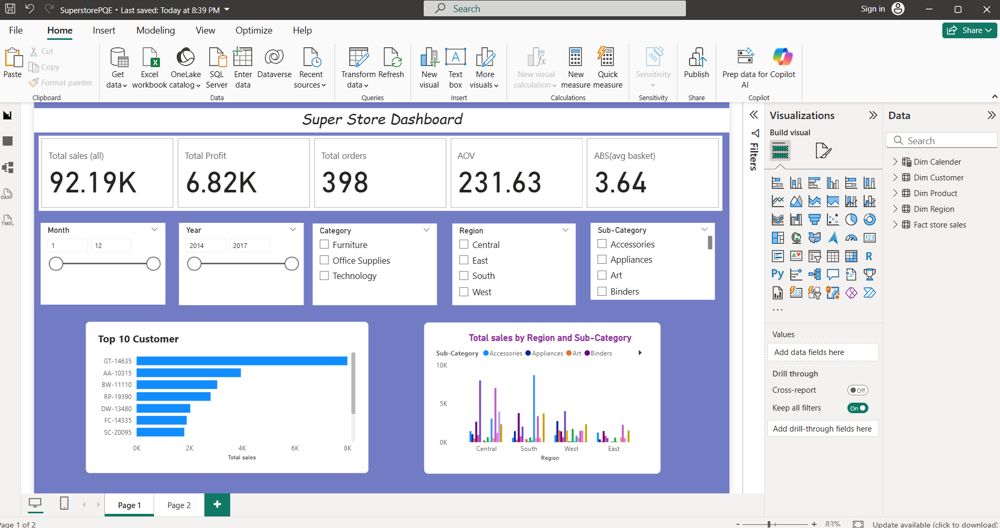
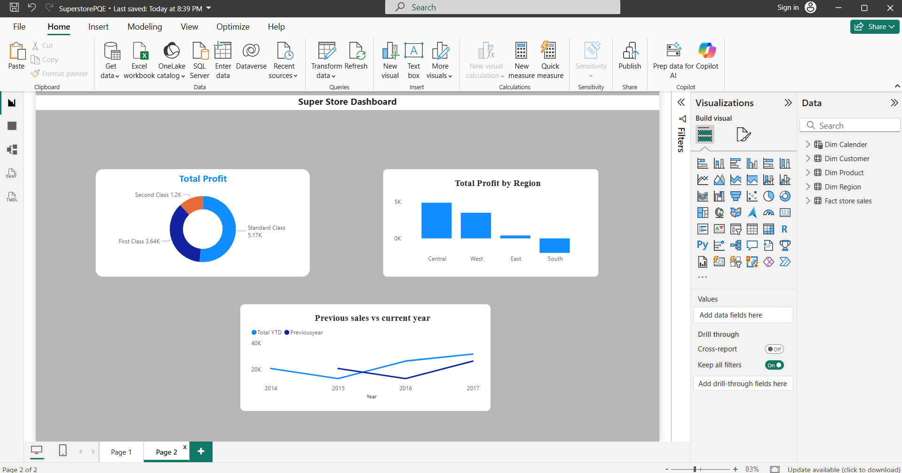

# 🏬 Superstore Sales Dashboard

## 📊 Project Overview
This project presents an interactive Power BI dashboard that analyzes Superstore sales data across categories, regions, customers, and time periods.  
The dashboard provides insights into overall sales, profit margins, customer behavior, and shipping performance.

## 🎯 Objectives
- Track overall sales and profit  
- Identify top product categories and sub‑categories  
- Analyze customer segments and top customers  
- Compare regional demand and profitability  
- Evaluate shipping performance and costs  
- Provide actionable insights for business growth  

## 📌 Key Insights Shown in Dashboard
- **Total Sales:** 92.19K  
- **Total Profit:** 6.82K  
- **Total Orders:** 398  
- **Average Order Value (AOV):** 231.63  
- **Average Basket Size (ABS):** 3.64  
- **Top Region by Profit:** Central  
- **Top Customer:** GT‑14635  
- **Profit Distribution:** Standard Class (5.17K), First Class (3.64K), Second Class (1.2K)  

## 📈 Dashboard Features
- 💰 Total Profit by Shipping Class  
- 🌍 Total Profit by Region  
- 📅 Previous Year vs Current Year Sales Trend (2014–2017)  
- 👥 Top 10 Customers by Sales  
- 🏷️ Total Sales by Region and Sub‑Category  
- 📊 Interactive filters for Month, Year, Category, Region, Sub‑Category  

## 🛠 Tools & Technologies Used
- Power BI  
- Microsoft Excel / CSV (Data Source)  
- Data Modeling  
- DAX Measures  
- Power Query  

## 📂 Dataset
The dataset includes:  
1. Sales by Category & Sub‑Category  
2. Sales by Region  
3. Profit by Shipping Class  
4. Year‑over‑Year Sales Trends  
5. Customer‑level Sales Data  
6. Orders, Basket Size, and Order Value metrics  

## 🖼 Dashboard Preview
The Superstore Dashboard consists of two pages that highlight different aspects of store performance.

### 📍 Page 1 – Overview

- KPIs: Total Sales, Profit, Orders, AOV, ABS  
- Profit by Shipping Class  
- Profit by Region  
- Previous Year vs Current Year Sales Trend  

---

### 📍 Page 2 – Detailed Analysis

- Top 10 Customers by Sales  
- Total Sales by Region and Sub‑Category  
- Interactive filters for deeper analysis  

---

## 🚀 How to Use
1. Download the `.pbix` file  
2. Open it using Power BI Desktop  
3. Navigate between pages to explore KPIs, trends, and customer insights  
4. Interact with filters, slicers, and visuals for deeper analysis  

## 📌 Use Cases
- Academic Mini / Major Projects  
- Data Analytics Portfolio  
- Retail Market Analysis  
- Business Intelligence Practice  

## 👤 Author
**Nivetha**  
📍 India  
🎓 Computer Science Engineering  

## ⭐ Feedback
If you find this project useful, please ⭐ star the repository and share your feedback!
